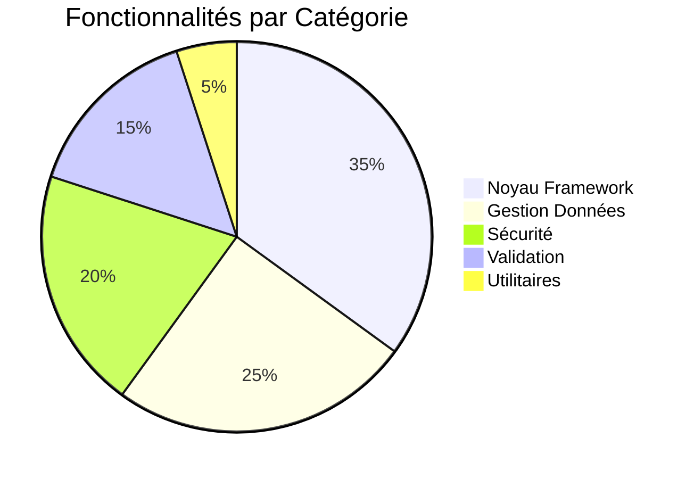
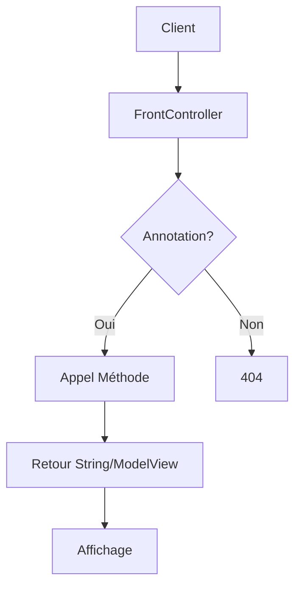

<div align="center" style="animation: pulse 2s infinite;">
  <h1 style="font-size: 2.5rem; background: linear-gradient(90deg, #00bbff, #d32ee5); -webkit-background-clip: text; color: transparent; margin-bottom: 20px;">
    Smooth Framework Java MVC
  </h1>
</div>

<style>
  @keyframes pulse {
    0% { transform: scale(1); }
    50% { transform: scale(1.05); }
    100% { transform: scale(1); }
  }
  .feature-card {
    transition: all 0.3s ease;
    border-left: 4px solid #6e48aa;
  }
  .feature-card:hover {
    transform: translateY(-5px);
    box-shadow: 0 10px 20px rgba(0,0,0,0.1);
  }
</style>
##  ETU002477
##  Installation

```xml
<!-- web.xml -->
<servlet>
    <servlet-name>FrontController</servlet-name>
    <servlet-class>mg.framework.controller.FrontController</servlet-class>
    <load-on-startup>1</load-on-startup>
    <init-param>
        <param-name>package_name</param-name>
        <param-value>controller</param-value>
    </init-param>
</servlet>
```

##  Fonctionnalités

##  Features Summary



<div style="text-align: center; margin: 30px 0;"> <div style="display: inline-block; padding: 10px 20px; background: linear-gradient(90deg, #6e48aa, #9d50bb); color: white; border-radius: 50px; animation: pulse 2s infinite;"> Framework Prêt pour la Production! </div> </div> ```


## 🛠 Configuration Minimaliste

```java
@Controller
public class MonController {
    @GET("/accueil")
    public ModelView accueil() {
        ModelView mv = new ModelView();
        mv.setUrl("page.jsp");
        mv.addData("message", "Bienvenue");
        return mv;
    }
}
```

##  Architecture



## Gestion d'Erreurs

```java
    try {
        // Code framework
    } catch (FrameworkException e) {
        response.getWriter().write(Error.getError(e.getMessage()));
    }
```

##  Avantages

-  Léger et performant
-  Configuration minimale
-  Intégration facile
-  Documentation complète

<div align="center" style="margin-top: 40px;">
  <div style="display: inline-block; animation: bounce 2s infinite;">
    ⚡ Prêt à l'emploi ⚡
  </div>
</div>

<style>
  @keyframes bounce {
    0%, 100% { transform: translateY(0); }
    50% { transform: translateY(-10px); }
  }
</style>

## Sprint 0

**Objectif:** Créer un servlet qui réceptionnera toutes les requêtes clients et qui les traitera

Coté Framework:

* Creation d'un servlet FrontController dont la methode processRequest affichera l'url dans lequel on se trouve

## Sprint 1

### **Modification dans mon framework :**

1. Creation d'une classe annotation du nom de Controller
2. Annoter mes controleurs avec Controller
3. Mettre mes controleurs dans le meme package

### **Modification dans FrontController :**

(Prendre le nom du package où se trouvent mes controleurs)

1. Tester si j'ai déjà scanner mes controleurs

* Si oui, afficher la liste des noms de mes controleurs
* Sinon scanner, puis afficher la liste des noms de mes controleurs

## Sprint 2

### **Objectif :**

Récupérer la classe et la méthode associées à une URL donnée

### **Étapes :**

Creation d'une annotation GET pour annoter les méthodes dans les contrôleurs

Creation d'une classe Mapping qui aura pour attributs :

* String className
* String methodName

Dans FrontController :

- Enlever l'attribut boolean
- Créer un HashMap (String url, Mapping)
- init :

    - Faire les scans pour avoir les contrôleurs

    * Pour chaque contrôleur, prendre toutes les méthodes et voir s'il y a l'annotation GET
    * S'il y en a, créer un nouveau Mapping : (controller.name, method.name)
    * HashMap.associer(annotation.value, Mapping)
- ProcessRequest :

    - Prendre le Mapping associé au chemin URL de la requête
    - Si on trouve le Mapping associé, afficher le chemin URL et le Mapping
    - Sinon, afficher qu'il n'y a pas de méthode associée à ce chemin

## Sprint 3

### **Objectif :**

Exécuter la méthode de la classe associée à une URL donnée

### **Étapes :**

* Dans le FrontController ( ProcessRequest ): Si on trouve le Mapping associé à l'URL ,

    * Récupérer la classe par son nom

    - Récupérer la méthode par son nom
    - Invoquer la méthode sur l'instance de la classe
    - Afficher la valeur retournée par la méhode

## Sprint 4

### **Objectif:**

Envoyer des données du controller vers view

### **Etapes:**

* Côté Framework
    * Création d'une classe ModelView qui aura pour attributs:
        * String url : url de destination après l'exécution de la méthode
        * HashMap<String : nom de la variable, Object: sa valeur> data : donnée à envoyer vers cette view
            * Création d'une methode"addData" qui a comme type de retour void pour pouvoir mettre les données dans HashMap
    * Dans FrontController
        * Dans la methode processRequest, récupération des données issues de la méthode annotée Get
            * si les data sont de type string, retour la valeur directement
            * si les données sont de type ModelView, récupération le url et dispatcher les données vers cet url
                * Boucle de data pour mettre y faire request.setAttribute et Dispatcher dans l'url (view)
            * si autre, retourner "methode de retour non reconnu"

## Sprint 5

### Objectif:

Gestion d'exception

### Etapes:

* **Building**
    * Exception si une annotation est dupliquee c'est a dire que plusieurs methodes ont la meme annotations
    * Exception si le package des controllers est vide ou n'existe pas
* **Process**
    * Exception "Error  404 not found" si l'url n'existe pas alors on ecrit sur la page
    * Exception si le type de retour du methode de la classe controller n'est pas un String ou un ModelView

## Sprint 6

### Objectif:

Envoyer des donnees du view vers controller

### Etapes:

* Creation d'une annotation RequestParam pour annoter les attrubuts d'une methode dans un controller
* Dans FrontController
    * Comparaison si le nom du parametre du formulaire correspond a l'anotation du parametre de methode correspondant a l'url
        * Si oui, assignation de la valeur du parametre du formulaire dans le parametre de la methode
            * Si la method retourne un String alors excecution la methode
            * Si c'est ModelView alors dispatch des donnees dans le view correspondant a l'url designe par ModelView
            * Sinon type de retour invalide
        * Si nombre de parametre du formulaire different du nombre de parametre du methode alors Exception de parametre insuffisant
    * Si jamais l'utilisateur du framework n'avais pas annoté ses paramètres d'utilisé le nom des paramètres en question.
        * Pour recuperer le nom des parametres, on utilisera une librairie externe paranamer de Throughwork: [paranamer-2.8](https://mvnrepository.com/.../com.../paranamer/2.8)
        * Et ajouter **-g** comme option a la compilation du projet

## Sprint 7

### **Objectif:**

Permett de passer un objet en paramètre d'une fonction et de parametrer ses attributs.

### **Etapes:**

1. Créer une annotation pour l'objet en paramètre
2. Créer un process qui va s'effectuer automatiquement lors que le programme détecte l'annotation créée plus tôt
    * Ce process va bouclé tous les attributs de l'objet pour obtenir leurs valeurs attribuées dans request.getParameter
    * Créer une nouvelle annotation de type ElementType.FIELD pour donner le choix aux utilisateurs du framework le choix entre utilisé le même nom dans sa classe et son formulaire ou annoté l'attribut avec le nom présent dans son formulaire sans devoir à utilisé le même nom

## Sprint 8

### **Objectif :**

Gestion et utilisation de session

### **Etapes :**

* Étape 1:

    * Créer une classe MySession ayant comme seul attribut HttpSession session

    - Ajouter fonctions get(String key), add(String key, Object objet), delete(String key)
* Étape 2 :

    * A l'appel des méthodes des controllers de l’utilisateur, pendant la génération des arguments, vérifier si le paramètre est de type MySession et dans ce cas, créer un MySession avec req.getSession()

## Sprint 9

### Objectif :

Exposition des actions du controller em REST API

### Etapes :

* Creer classe annotation RestAPI
* Dans FrontServlet, verification de l'axistence de l'annotation
    * Si annotation n'existe pas --> continuer comme avant
    * Si oui
        * Recuperer la valeur de retour  du methode
            * Si ModelView, transformation en Json de la valeur de l'attribut data
            * Sinon, transformation en Json directement

## Sprint 10

### Objectif :

Récupérer la classe et la méthode associées à une URL donnée (Suite)

### Etapes :

* Creation d'une nouvelle annotation POST et d'une annotation URL qui va conserver l'url et enlever la valeur de l'url dans GET
* Si la methode n'est ni annote GET ou POST, on utilise GET par defaut
* Savoir si la methode est annote GET ou POST et l'url dependra de cela
* Creer une classe VerbAction qui aura comme attibut VERB et METHODNAME pour pouvoir permettre a 2 methodes differentes d'avoir le meme url mais avec differents verb
* Ajouter une list de VerbAction dans Mapping
* Si la methode d'appelle de l'url est different de l'annotation de la methode dans la classe controller, une exception sera leve

## Sprint 11

### Objectif :

Gestion d'exception dans une page web

### Etapes :

Afficher les exceptions gerer precedement dans le Sprint 5 dans une page web sous forme de String en utilisant response.getWriter() et response.setContentType("text/html")

## Sprint 12

### Objectif :

Permettre la recuperation de fichier par formulaire

### Etapes :

* Annoter par l'annotation @MultipartConfig la classe FrontController
* Dans la methode preparedParameter ajouter une condition que si le parametre de la methode du controller est de type Part alors au lieu de request.getParameter on recupere la valeur par request.getPart

## Sprint 13

### Objectif :

Validation de formulaire

### Etapes :

* Creer des annotations d'attribut de validations comme @Required, @Numeric, @Mail, @Date
* Si un attribut est annote par l'un ou plusieurs de ces annotations mais que les valeurs venant du formulaire ne correspond pas selon l'annotation par exemple si un attribut est annote @Required alors que la valeur du formulaire est vide une exception sera levee

## Sprint 14

### Objectif :

Validation de formulaire

### Etapes :

* Creer des annotations d'attribut de validations comme @Required, @Numeric, @Mail, @Date
* Si un attribut est annote par l'un ou plusieurs de ces annotations mais que les valeurs venant du formulaire ne correspond pas selon l'annotation par exemple si un attribut est annote @Required alors que la valeur du formulaire est vide une erreur sera retourner au dessus de l'input correspondant et les valeurs valident seront aussi retourner sur l'input correspondant
    * Cela se fait par les fonctions ValidationManager.error(nom_de_input) et ValidationManager.value(nom_de_input)

## Sprint 15

### Objectif :

Authentification au niveau methode

### Etapes :

* Creation d'une annotation pour le niveau d'authentification de la methode
* Creation d'une classe pour l'authentification du client qui sera conserver dans une session
* Comparer le niveau d'authentification de la methode avec le niveau d'authentification du client
    * Si le niveau d'authentification de la methode est inferieur ou egale au niveau d'authentification du client alors la methode est accessible au client
    * Sinon une exception sera leve que la methode n'est pas accessible au client


## Sprint 16

### Objectif :

Authentification au niveau classe (Controller ou Model)

### Etapes :

* Creation d'une annotation pour le niveau d'authentification de la classe
* Creation d'une classe pour l'authentification du client qui sera conserver dans une session
* Comparer le niveau d'authentification de la classe avec le niveau d'authentification du client
    * Si le niveau d'authentification de la methode est inferieur ou egale au niveau d'authentification du client alors la classe est accessible au client
    * Sinon une exception sera leve que la methode n'est pas accessible au client


## Sprint 17

### Objectif :

Autres utilitaires

### Etapes :

* Creation d'une annotation pour l'url d'une classe Controller (@BaseUrl)
* Si une classe est annote @BaseUrl
    * Concatenation de la valeur de l'annotation avec celui de la methode associe a la classe Controller
* Creation d'une classe pour la redirection
    * Mettre l'url de redirection dans la classe
    * Creer une methode de redirection a appeler pour la redirection dans une page ou dans un controller
